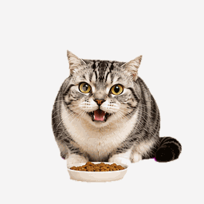
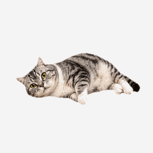
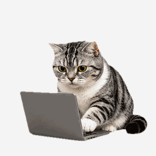
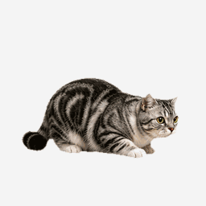
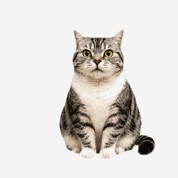

# 玖玖提醒

轻量 Mac 本地桌宠提醒应用。使用 Swift + AppKit 构建，不接入网络，配置保存在本机 `UserDefaults`。

玖玖会常驻桌面，用不同动作提示工作、休息、喝水和状态切换。应用内置经典与写实两套皮肤，选择和窗口位置都保存在本机。

App 图标来自玖玖猫咪形象，打包脚本会自动把 `Resources/AppIcon.icns` 写入 `.app`。

## 功能

- 桌面透明悬浮宠物窗口，可拖拽并保存位置。
- 右键可将桌宠调整为 60% / 80% / 100% / 125% / 150%，尺寸会自动保存。
- 动作按各自节奏播放，只在完整循环结束后切换，并使用短过渡减少跳变。
- 右键“桌宠皮肤”可切换“经典玖玖”和“真实玖玖”，重启后保持选择。
- 真实玖玖包含吃猫粮、喝水、翻肚打滚、舔毛、追蝴蝶、工作、睡觉、伸懒腰和坐立观察九组 12 帧动作。
- 真实玖玖支持 30 秒逗猫棒和投喂猫条互动；道具跟随鼠标，猫咪在当前屏幕内追逐，结束后回到原位。
- 工作 / 休息循环提醒。
- 喝水间隔提醒，支持稍后提醒。
- 强提醒窗口支持最小化和关闭；关闭喝水提醒会自动按稍后提醒处理，关闭休息提醒不会中断倒计时。
- 右键菜单支持暂停、继续、重置本轮、设置时间、切换动作展示。
- 可选开机启动入口。

## 演示案例

### 写实动作

| 吃猫粮 | 翻肚打滚 | 工作 |
| --- | --- | --- |
|  |  |  |

### 鼠标互动

| 逗猫棒追逐 | 投喂猫条 |
| --- | --- |
|  |  |

使用方式：

1. 右键桌宠，在“桌宠皮肤”中选择“真实玖玖”。
2. 从“桌宠动作”中手动查看九种生活动作，或选择“生活轮播”。
3. 从“互动”中启动“逗猫棒”或“投喂猫条”；投喂时将猫条靠近桌宠并单击。
4. 互动会在 30 秒后自动结束，也可以选择“停止互动”，桌宠随后返回原位置。

## 环境要求

- macOS 13 或更新版本
- Swift 6 工具链

## 开发运行

```bash
swift run
```

首次启动会要求设置工作时长、休息时长和喝水间隔。桌宠可拖拽，右键打开菜单。

## 打包

```bash
chmod +x scripts/build_app.sh
./scripts/build_app.sh
open "dist/Jiujiu Reminder.app"
```

生成的 `.app` 位于 `dist/Jiujiu Reminder.app`，可以移动到 `/Applications`。

## 项目结构

```text
.
├── Package.swift
├── Resources/
│   ├── AppIcon.icns
│   ├── AppIcon.png
│   ├── spritesheet.png
│   └── Skins/realistic/
│       ├── spritesheet-realistic.png
│       ├── interaction-treat.png
│       ├── butterfly.png
│       ├── wand-lure.png
│       └── cat-treat.png
├── Sources/JiujiuReminderApp/
│   ├── AppDelegate.swift
│   ├── PetSkin.swift
│   ├── PetInteractionController.swift
│   ├── PetWindowController.swift
│   ├── ReminderEngine.swift
│   ├── SettingsWindowController.swift
│   └── SpriteSheet.swift
└── scripts/
    ├── build_app.sh
    └── realistic_skin_pipeline.py
```

## 验证建议

- 把工作、休息、喝水都临时设为 1 分钟，确认提醒流程。
- 右键桌宠确认暂停、继续、重置本轮、设置时间可用。
- 逐档切换桌宠大小，确认窗口不会超出当前屏幕，重启后尺寸保持。
- 切换“休息轮播”，确认每个动作完整播放后再自然过渡到下一个动作。
- 分别切换两套皮肤，确认右键动作列表随皮肤变化，重启后仍使用上次皮肤。
- 在真实玖玖下启动逗猫棒和投喂猫条，确认其他应用仍可点击、猫咪不会越过菜单栏或 Dock，并在停止或超时后返回原位。
- 触发休息和喝水提醒，确认可最小化；关闭休息提醒后倒计时继续，关闭喝水提醒后会再次提醒。
- 拖动桌宠后退出重开，确认位置被保存。

## License

MIT
